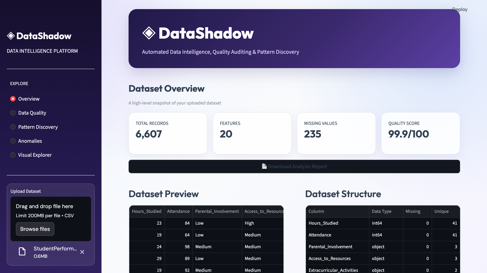
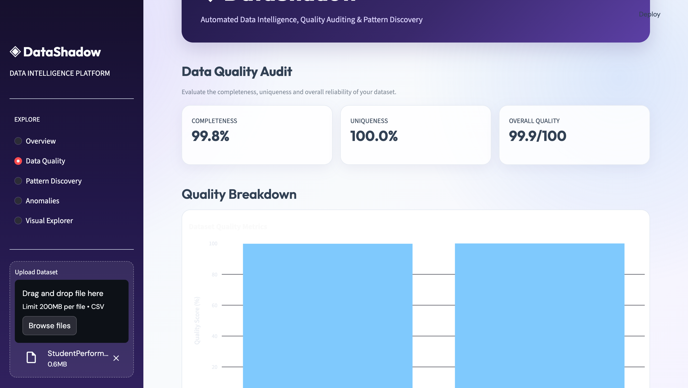
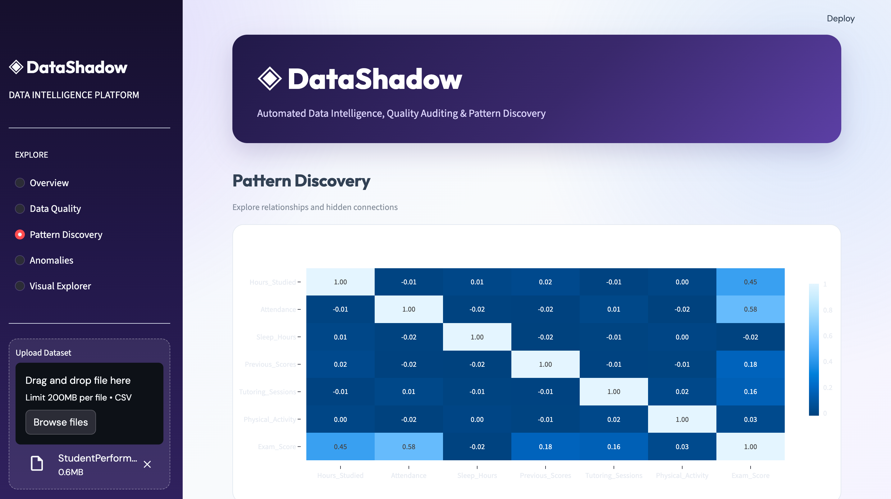
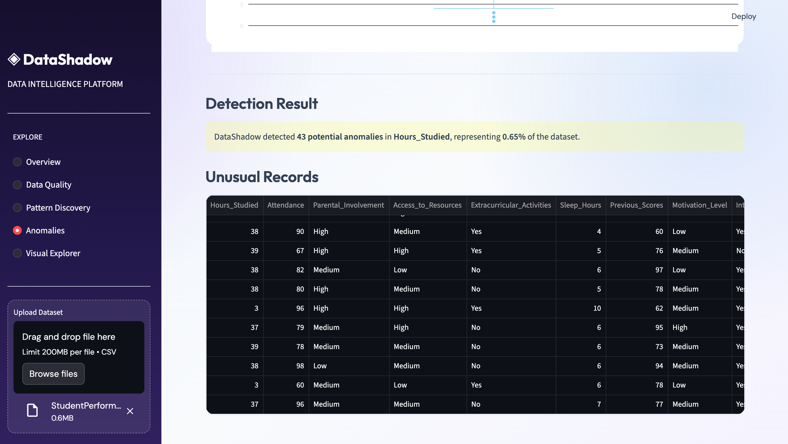

# DataShadow

### Automated Data Intelligence, Quality Auditing & Pattern Discovery

DataShadow is an interactive data analysis application built with Python and Streamlit. It allows users to upload CSV datasets and automatically explore dataset structure, evaluate data quality, discover relationships, detect anomalies, and create interactive visualizations.

## Features

### Dataset Overview

* Upload CSV datasets
* View total records and features
* Identify missing values
* Calculate an overall data quality score
* Preview the dataset
* Analyze column data types, missing values, and unique values

### Smart Insights

* Dataset composition analysis
* Missing-data insights
* Duplicate record detection
* Automatic data quality assessment
* Strongest correlation insight

### Data Quality Audit

* Completeness analysis
* Uniqueness analysis
* Missing value detection
* Duplicate record analysis
* Overall data quality scoring
* Automatic quality assessment

### Pattern Discovery

* Correlation analysis
* Interactive correlation heatmap
* Identification of strong relationships between numerical variables
* Positive and negative correlation insights

### Anomaly Detection

* IQR-based anomaly detection
* Automatic lower and upper boundary calculation
* Anomaly count and anomaly rate
* Box plot visualization
* Display of unusual records

### Visual Explorer

* Histogram
* Scatter Plot
* Box Plot
* Bar Chart
* Dynamic column selection
* Safe handling of numerical-only, categorical-only, and mixed datasets

### Export Analysis Report

Generate and download a dataset analysis report containing:

* Dataset overview
* Data composition
* Missing values
* Duplicate records
* Completeness score
* Uniqueness score
* Overall data quality score

## Tech Stack

* Python
* Pandas
* NumPy
* Plotly
* Streamlit

## Project Structure

```text
DataShadow/
│
├── app.py
├── requirements.txt
├── screenshots
├── README.md
└── .gitignore
```

## Installation

Clone the repository:

```bash
git clone YOUR_REPOSITORY_URL
```

Navigate to the project folder:

```bash
cd DataShadow
```

Install the required libraries:

```bash
pip install -r requirements.txt
```

Run the application:

```bash
streamlit run app.py
```

## How It Works

```text
Upload CSV Dataset
        ↓
Dataset Overview
        ↓
Data Quality Audit
        ↓
Smart Insights
        ↓
Pattern Discovery
        ↓
Anomaly Detection
        ↓
Interactive Visual Exploration
        ↓
Download Analysis Report
```

## Data Quality Score

The overall data quality score is calculated using:

```text
Data Quality Score = (Completeness + Uniqueness) / 2
```

Where:

**Completeness** measures the percentage of non-missing data.
**Uniqueness** measures the percentage of non-duplicate records.

## Anomaly Detection Method

DataShadow uses the **Interquartile Range (IQR)** method to identify potential anomalies.

```text
IQR = Q3 - Q1

Lower Bound = Q1 - 1.5 × IQR

Upper Bound = Q3 + 1.5 × IQR
```

Values outside these boundaries are identified as potential anomalies.

## Future Improvements

* Support for Excel datasets
* Advanced anomaly detection algorithms
* Automated data cleaning suggestions
* PDF report generation
* Machine learning-based pattern detection

## ScreenShots

### Welcome page


### Dataset Overview



### Data Quality Audit



### Pattern Discovery



### Anomaly Detection



### Visual Explorer


## Author : Jananee M R

Built as a Data Analysis and Data Intelligence project using Python.

---
